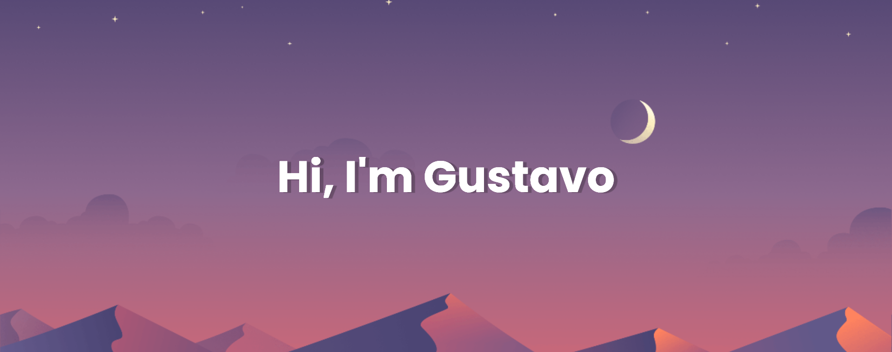

<h3 aligh="left">About Me:</h3>

Olá, seja <b>Bem-Vindo(a)</b> ao meu git. Meu nome é <b>Gustavo</b> ja fui professor de Inglês e agora estou em busca de me aprender  programação mais voltado para <strong>Back-end</strong> e <strong>Game Developer</strong>, e de vez em quando me divirto Noobando alguns jogos por ai!

<h1 align="left"><strong> Alguns lugares que eu uso :3</h1>

<h2 align="left"><strong>MINHAS SKILLS:</h2>

 

<h2 align="left"><strong>Linguagem que irei estudar:</h2>

